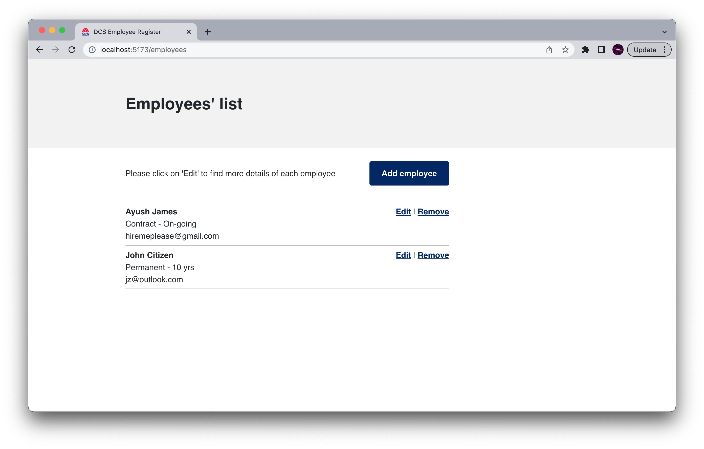
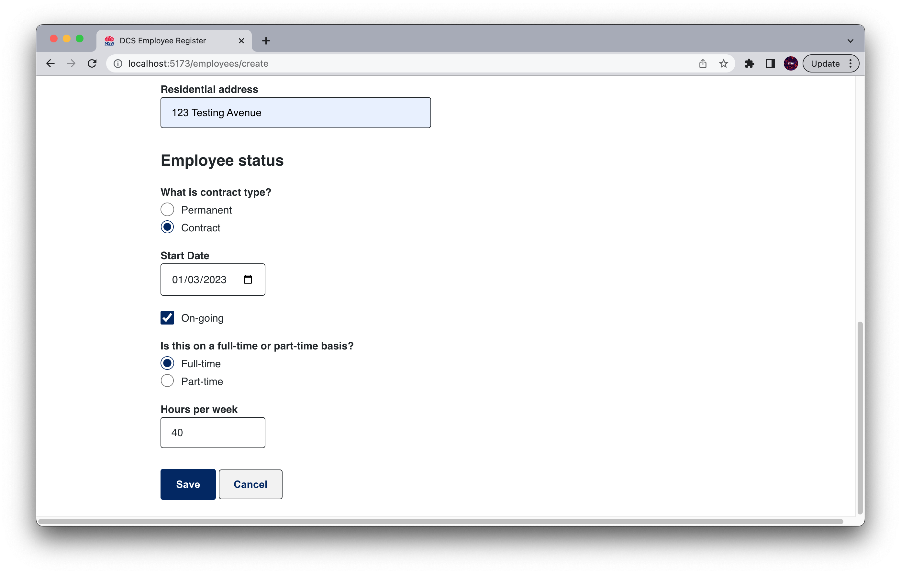

# DCS Employee Register - Tech Test

An employee register for the Department of Customer Service (DCS). This full-stack web application was built using React Typescript (frontend) and Java Spring (backend) and MySQL(database). BEM methodology was used for SaSS styling, which also made reference to the Digital.NSW website (did you notice the favicon and the color variables?).

## ScreenShots




## MVP

Create an employee register that allows a user to:

- [x] Create an employee
- [x] Get a list of existing employees that have been generated
- [x] Update the details of an employee
- [x] Delete an employee

## Features

- The styling makes references to Digital.NSW website
- Before you delete a file, a prompt confirmation is provided to allow for user to cancel the execution (in case of accidental click)
- The page is reponsive
- Redirects to default route "/employees" if route does not match.
- User Experience have been considered in the development of the form component. The date inputs have been consolidated into a single date input (less inputs for the user to complete), and the "on-going" checkbox input toggles between displaying or hidding the end-date input (so as to create less confusion for the user on input requirements).

## Challenges

- It definitely was a challenge to complete a full-stack app using in such a short-frame, however it has been a rewarding experience to see how much I could pick up (typescript in react, new react libraries, tryingt to implement testing) and what I could create in that time.
- I was struggling with the implementation of tests - NOTE: This is NOT COMPLETE and is still a work in progress!

### Testing

I have implemented some simple testing for the rendering and user interactions of the front end. If I had more time I would have implemented the following:

#### Form

- Should contain x number of inputs

#### Testing User Interaction

- clicking save with no values, should show display validation texts
- clicking cancel should go back to employees' list page
- toggling the ongoing button should hide the endDate input.
- toggling the ongoing button to false should display the endDate input and it should be blank
- clicking part-time or full-time should change the maxValue input for Weekly hours.

## Things to Improve

- Input for dates could be separated as per the MVP. Three separate inputs (number, option, number), gather values as dd-mm-yyyy and use the setValue for endDate to return the value to the backend.
- Could use google maps api to suggest address for the street address input.
- number of hours input could take in decimal values instead of whole numbers.
- More validation can be completed, e.g. checking if end date < start date or any other business specific requirements.

## Reflection/Learning

- I have so much more appreciation for React in Javascript, but can appreciate the benefits of picking up bugs and errors early in using React Typescript.
- I had found Java to be challenging, so this was a very good practice to reaffirm my understanding. Definitely plenty to still learn, but I am feeling more confident about my next run at this.
- Picked up React-Hook-Form, but couldn't figure out React-Query - will probably have a crack at this again for another project.
- It was fun to look under the hood of the NSW.digital website and recreate styling varibales.

## Pointers on compiling and running the app

Start by cloning the repo to your local device

### For Front End

Once your have changed directories into the "dsc-employees" folder in your Terminal, make sure to install the dependencies before running the app.

```
cd dsc-employees
npm install
npm run dev
```

Note that the homepage endpoint is '/employees'
e.g 'http://localhost:5173/employees' however, page routing will automatically link you to this page. 

You can close the server with Control + C on Mac. 
You can run the tests on react using the following command in Terminal
```
npm run test
```


### For DB - MySqlWorkbech

Create a DB to store your data by writing the following: 
Note: Make sure to have the name match the file name in the "application.properties" in Eclipise (see For Backend - Eclipise)

```
CREATE DATABASE <YOUR_MYSQL_DB_NAME>
```

Later, you can also use the following to view the data that is saved into the DB.

```
USE dcs_employees;
SHOW TABLES;
SELECT * FROM employees;
```

If you are having errors running mySqlWorkbench try the following to start the server from your Terminal

```
mysql.server start
```

### For Backend - Eclipise

1. Open Eclipise and import the file within "backend"
- File > Import > Maven > Existing Maven Projects > Browse for the "employeeslist" folder
- Tip: the folder level you open should contain the pom.xml file.

2. Once you have the project open, within the "application.properties" file, ensure you have the following (replace the values within "<>"):

```
spring.datasource.url=jdbc:mysql://localhost:3306/<YOUR_MYSQL_DB_NAME>
spring.datasource.username=root
spring.datasource.password=<YOUR_PASSWORD_OR_REMOVE_IF_NO_PASSWORD>
spring.jpa.hibernate.ddl-auto=update
spring.jpa.properties.hibernate.dialect = org.hibernate.dialect.MySQL5InnoDBDialect
spring.jpa.generate-ddl=true
```

3. You are now ready to Run the app. Make sure to run the program from 'gov.dcs.employeeslist' class. This will activate the backend.
- Select gov.dcs.employeeslist (employeeslist/src/main/java/gov.dcs.employeeslist)
- You can Run the app by pressing the green play button or right clicking on gov.dcs.employeeslist and selecting > Run As > Java Application


## Useful Resources

- [React + Fetch: GET, POST, PUT, DELETE](https://jasonwatmore.com/post/2020/01/27/react-fetch-http-get-request-examples)
- [Passing Object as props to a component in React Typescript](https://bobbyhadz.com/blog/react-typescript-pass-object-as-props)
- [React-Hook-Form - Form validation](https://react-hook-form.com/get-started/)
- [React-Router](https://reactrouter.com/en/main/start/tutorial)
- [React Typescript Cheatsheet](https://react-hook-form.com/get-started/)
- [Spring Initializr](https://start.spring.io/)
- [Logging in Spring Boot](https://www.baeldung.com/spring-boot-logging)

---

### Reachout

- [LinkedIn](https://au.linkedin.com/in/ayushjames)
- [Email](mailto:ayushpjames@gmail.com)
- [Portfolio]()
